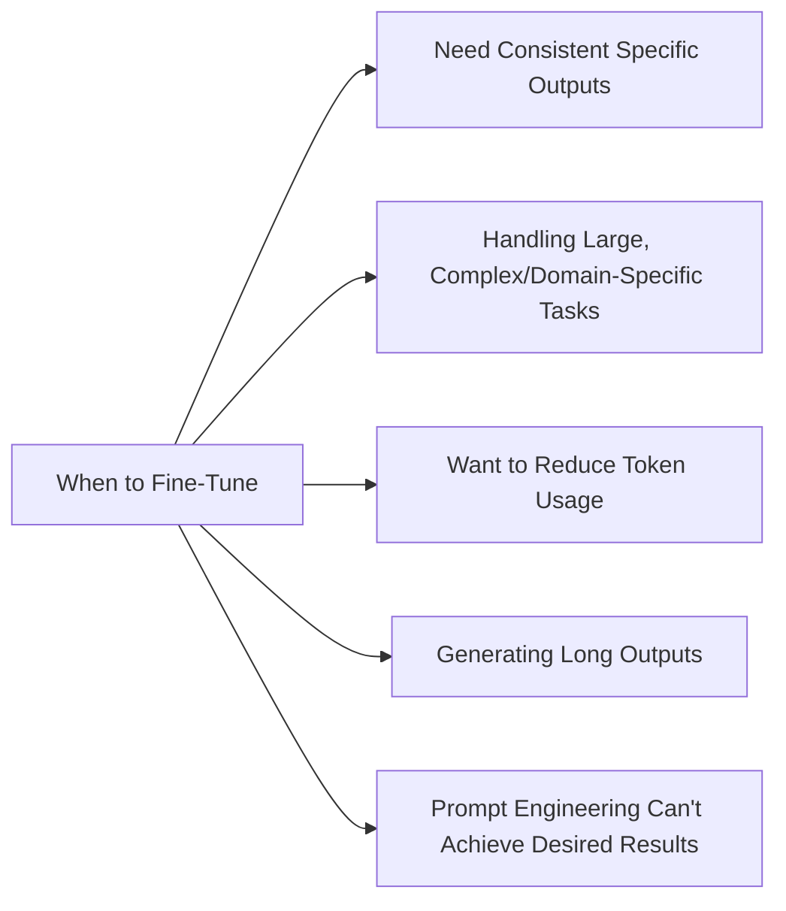
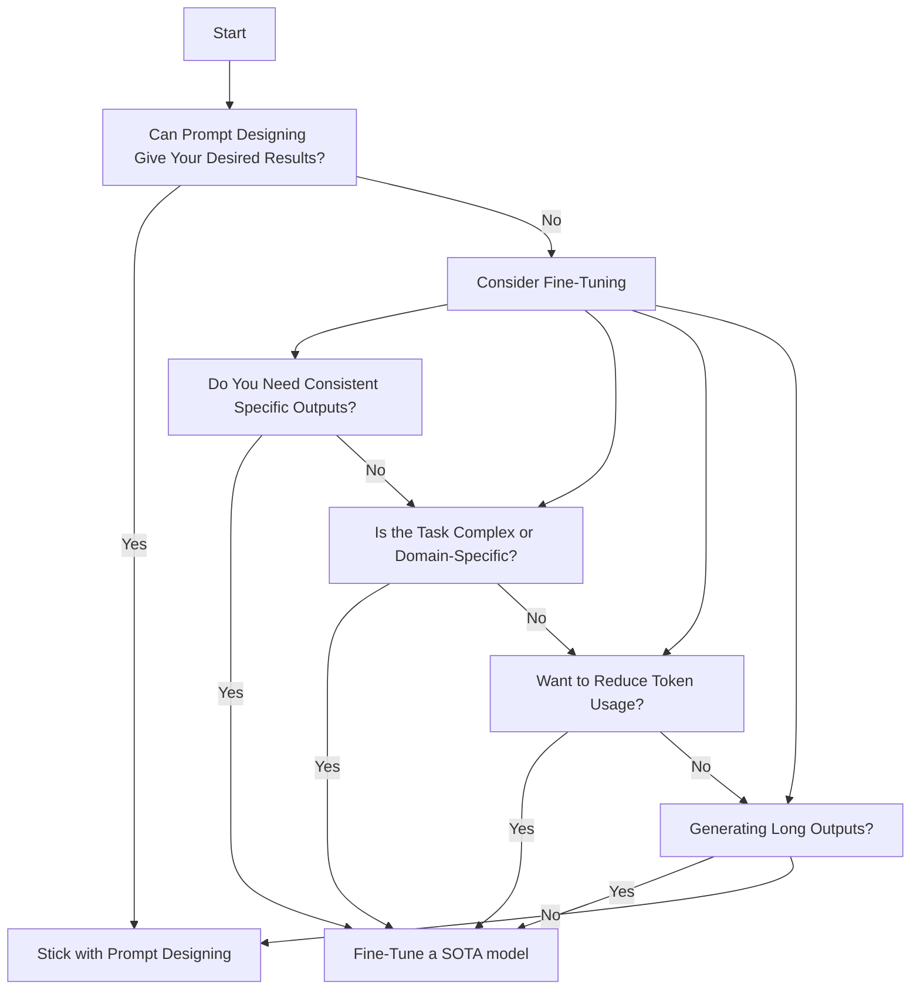

# Reusable OpenAI Fine-Tune
> Use this codebase to fine-tune OpenAI models with your own data.

## Setup
- Install [uv](https://docs.astral.sh/uv/getting-started/installation/)
- Install dependencies `uv sync`
- Set your OpenAI API key as an environment variable `export OPENAI_API_KEY=<your_api_key>`

## Fine-Tune Process Example Commands
- `uv run finetune upload-dataset datasets/example-sarcastic-factbot.jsonl` - Upload a the example dataset to the fine-tune API
- `uv run finetune list-files` - List all files uploaded for fine-tuning. You should see `example-sarcastic-factbot.jsonl`
- `uv run finetune train-model example-sarcastic-factbot.jsonl --model gpt-4o-2024-08-06` - Train a fine tuned model given the example dataset and base model
- `uv run finetune list-jobs` - List all fine-tune jobs. You should see your job in the list
- `uv run finetune fine-tune-prompt <model_name> <prompt> [--system-message <system_message>]` - After model training, send a prompt to a fine-tuned model and get the response

## Commands

### Dataset File Management
- `uv run finetune list-files` - List all files uploaded for fine-tuning
- `uv run finetune delete-files-by-name <file_name>` - Delete all files that match the given name
- `uv run finetune upload-dataset <file_path>` - Upload a dataset to the fine-tune API

### Fine-Tune Model Training
- `uv run finetune list-jobs` - List all fine-tune jobs
- `uv run finetune train-model <file_name> [--model <model_name>]` - Start a fine-tuning job with the specified file and model
- `uv run finetune list-job-events <fine_tune_job_id>` - List the events for a fine-tuning job
- `uv run finetune retrieve-job <job_id>` - Retrieve the state of a fine-tuning job
- `uv run finetune cancel-job <job_id>` - Cancel a fine-tuning job

### Fine-Tune Prompting
- `uv run finetune fine-tune-prompt <model_name> <prompt> [--system-message <system_message>]` - Send a prompt to a fine-tuned model and get the response

## Tools + Resources
- [OpenAI GPT-4o Fine-Tune](https://openai.com/index/gpt-4o-fine-tuning/)
- [OpenAI Fine-Tune Pricing](https://openai.com/api/pricing/)
- [OpenAI Fine-Tune API](https://platform.openai.com/docs/guides/fine-tuning)
- [OpenAI Python](https://github.com/openai/openai-python)
- [Platform OpenAI Fine-Tune Page](https://platform.openai.com/finetune)
- [Platform OpenAI File Storage Page](https://platform.openai.com/storage/files)
- [uv](https://docs.astral.sh/uv/getting-started/installation/) (hyper fast hyper modern python package manager - replaces pip, poetry, etc.)
- [typer](https://typer.tiangolo.com/) (python package for building CLI apps)

---

## WHEN & WHY fine-tune?

### Simple 

### Decision Diagram

### Reasons to fine-tune
1. Consistency in specific outputs
   - Fine-tuning adjusts the model's internal weights, leading to more reliable and predictable responses across similar tasks
2. Handling complex or domain-specific tasks
   - When your application requires deep understanding of specialized fields, fine-tuning can significantly improve performance
3. Improved token efficiency
   - Fine-tuned models often require shorter prompts, reducing token usage and potentially lowering costs
4. Better performance on long outputs
   - Fine-tuning helps maintain coherence and adherence to instructions throughout longer generations
5. Overcoming limitations of prompt engineering
   - If you've tried structured outputs, have several examples, and are still not getting the results you're looking for, fine-tuning can force more consistent behavior across tasks

### Reasons not to fine-tune
1. When prompt engineering can achieve desired results
   - If you can get satisfactory performance through careful prompt design, fine-tuning may be unnecessary
2. For tasks that require quick iteration and feedback
   - Fine-tuning has a longer feedback loop compared to prompt engineering, making rapid experimentation more difficult
3. When the task doesn't require specialized knowledge
   - For general tasks where the base model's knowledge is sufficient, fine-tuning may not provide significant benefits

---

### When to use fine-tuning ([from OpenAI](https://platform.openai.com/docs/guides/fine-tuning))
Fine-tuning OpenAI text generation models can make them better for specific applications, but it requires a careful investment of time and effort. We recommend first attempting to get good results with prompt engineering, prompt chaining (breaking complex tasks into multiple prompts), and function calling, with the key reasons being:

- There are many tasks at which our models may not initially appear to perform well, but results can be improved with the right prompts - thus fine-tuning may not be necessary
- Iterating over prompts and other tactics has a much faster feedback loop than iterating with fine-tuning, which requires creating datasets and running training jobs
- In cases where fine-tuning is still necessary, initial prompt engineering work is not wasted - we typically see best results when using a good prompt in the fine-tuning data (or combining prompt chaining / tool use with fine-tuning)
- Our prompt engineering guide provides a background on some of the most effective strategies and tactics for getting better performance without fine-tuning. You may find it helpful to iterate quickly on prompts in our playground.

### When to use fine-tuning ([from Anthropic](https://www.anthropic.com/news/fine-tune-claude-3-haiku))

#### Overview of fine-tuning

Fine-tuning is a popular technique to improve model performance. By creating a customized version of the model, you can train the model to excel at highly tailored workflows.

To fine-tune Claude 3 Haiku, you first prepare a set of high quality prompt-completion pairs—the ideal outputs that you want Claude to provide for a given task. The fine-tuning API, now available in preview, will use your data to create your own custom Claude 3 Haiku. Using the Amazon Bedrock console or API, you can test and refine your custom Claude 3 Haiku model until it meets your performance goals and is ready for deployment.

#### Benefits

Fine-tuning allows you to customize Claude 3 Haiku so it can acquire specialized business knowledge, leading to improved accuracy and consistency. Benefits include:

- Better results on specialized tasks: Enhance performance for domain-specific actions such as classification, interactions with custom APIs, or industry-specific data interpretation. Fine-tuning allows Claude 3 Haiku to excel in areas crucial to your business compared to more general models by encoding company and domain knowledge.

- Faster speeds at lower cost: Reduce costs for production deployments where Claude 3 Haiku can be used in place of Sonnet or Opus, while also returning results faster.

- Consistent, brand-aligned formatting: Generate consistently structured outputs tailored to your exact specifications like standardized reports or custom schemas, ensuring compliance with regulatory requirements and internal protocols.

### When to use fine-tuning ([from Google Gemini](https://ai.google.dev/gemini-api/docs/model-tuning))

Fine-tuning with the Gemini API

Fine-tuning can improve your model's performance on specific tasks or help the model adhere to specific output requirements when instructions aren't sufficient and you have a set of examples that demonstrate the desired outputs.

When to use fine-tuning:

1. When prompt design strategies like few-shot prompting don't produce the results you need.

2. For improving performance on specific tasks.

3. To help the model adhere to specific output requirements.

4. When you have a set of examples demonstrating the outputs you want.

5. For niche tasks where significant improvements can be achieved with a modest number of examples.

6. To teach the model to mimic wanted behavior or tasks by providing many illustrative examples.

7. When you need to encode additional information for performing specific tasks or behaviors.

8. For tasks requiring high-quality, diverse, and representative examples of real inputs and outputs.

9. When your application needs consistent formatting, keywords, instructions, or information in both training and production data.

10. If you need to improve model performance for specialized tasks like classification, interactions with custom APIs, or industry-specific data interpretation.

11. To reduce costs and increase speed in production deployments.

12. For generating consistently structured outputs tailored to exact specifications, ensuring compliance with requirements and protocols.

---

### Examples for fine-tuning
- Custom software assistants
  - Fine-tuning can create specialized AI assistants for software development tasks, such as code refactoring, bug detection, or generating unit tests tailored to specific coding standards and practices.
  - These assistants can be trained to follow company-specific coding guidelines, improving code consistency across large teams.
- Brand-specific customer support
  - Fine-tuning allows models to adopt a company's unique tone, style, and knowledge base, ensuring consistent and accurate responses aligned with brand guidelines across all customer interactions.
  - This can include training on company-specific products, policies, and frequently asked questions to provide more accurate and relevant support.
- Legal document analysis
  - Fine-tuned models can be trained to understand complex legal terminology, identify key clauses, and extract relevant information from various types of legal documents with high accuracy.
  - They can be customized to focus on specific areas of law or jurisdictions, enhancing their utility for specialized legal practices.
- Medical information retrieval
  - Models fine-tuned on medical literature and clinical data can provide more accurate and context-aware responses to healthcare professionals' queries, improving patient care and research efficiency.
  - These models can be tailored to specific medical specialties or research areas, offering more targeted and relevant information.
- Financial modeling
  - Fine-tuning enables models to understand intricate financial concepts, perform complex calculations, and generate detailed financial reports tailored to specific industry standards and regulations.
  - Custom models can be developed for tasks like risk assessment, market analysis, or portfolio optimization, incorporating proprietary methodologies and data sources.

### Examples for prompt designing
- General question answering
  - Well-crafted prompts can guide base models to provide accurate and relevant answers to a wide range of general knowledge questions without the need for fine-tuning.
  - This approach is flexible and can be quickly adapted to different types of questions or knowledge domains.
- Simple text generation tasks
  - Prompt engineering can effectively instruct models to generate short stories, product descriptions, or social media posts with specific themes or styles.
  - By carefully structuring prompts, users can control the tone, length, and content of generated text without model modifications.
- Basic language translation
  - Carefully designed prompts can help models perform translations between common language pairs for everyday phrases and sentences.
  - This method allows for quick adjustments to translation style or context without the need for extensive model retraining.
- Sentiment analysis
  - Prompts can be engineered to guide models in accurately classifying the sentiment of text as positive, negative, or neutral across various contexts and domains.
  - This approach offers flexibility in defining sentiment categories and adapting to different types of text or industry-specific language.
- Text summarization
  - Effective prompt design can instruct models to create concise summaries of longer texts, highlighting key points and maintaining the original context.
  - Users can adjust prompts to focus on specific aspects of the text or to generate summaries of varying lengths.
- Creative writing assistance
  - Prompts can be crafted to help models generate writing prompts, character descriptions, or plot outlines for aspiring writers.
  - This method allows for quick iteration and experimentation with different creative directions without the need for model retraining.